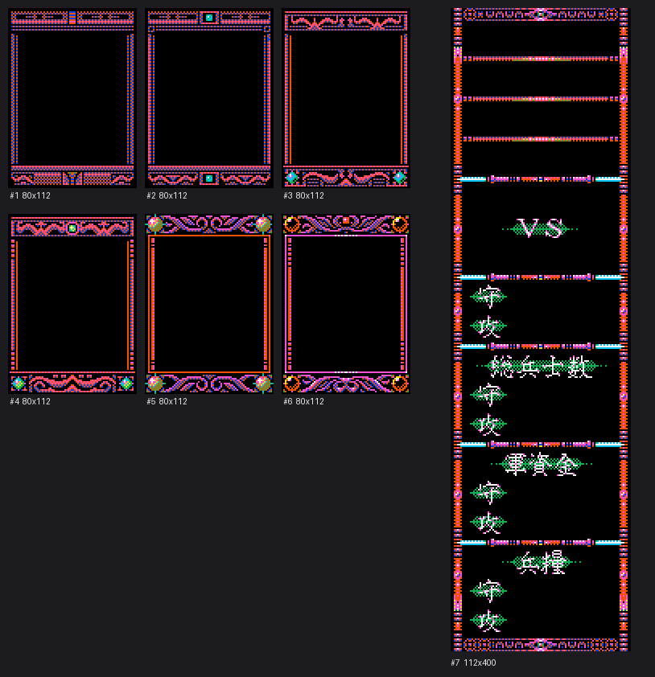

# 三国志3 GRPDATA.DAT 图形解析

## 概述 / Overview

**中文**：`GRPDATA.DAT`（42,327 字节）是 DOS 版《三国志3》（光荣 KOEI，1992）的**界面窗口图形数据**，由游戏主程序 `MAIN.EXE` 加载。文件内是消息框/对话框的窗口边框与底版，共 7 张图（6 张 80×112 窗口框变体 + 1 张 112×400 全高竖版框），之后还有 33,044 字节同类压缩图形流。

格式与《三国志II》的 `GRPDATA.DAT` 相同（KOEI 早期通用的 NPK 式压缩，3 bit/像素、8 色），本目录提供完整解码脚本与渲染结果。

**English**: `GRPDATA.DAT` (42,327 bytes) holds the in-game UI window frames of the DOS *Romance of the Three Kingdoms III* (KOEI, 1992), loaded by `MAIN.EXE`. It contains 7 images (six 80×112 window-frame variants plus one 112×400 full-height frame) followed by 33,044 more bytes of the same compressed graphics stream. The format matches San II's `GRPDATA.DAT` (KOEI NPK-style compression, 3 bpp / 8 colors).

---

## 文件结构 / File Layout

每张图 = 4 字节头（宽、高各 2 字节小端序）+ KOEI NPK 式压缩数据。逐图解析后，每张图都恰好解出 `宽×高` 个像素、压缩流刚好用完。

| 图 | 偏移 | 尺寸 | 压缩体 | 解压后 |
|---|---:|---:|---:|---:|
| 1 | 0 | 80×112 | 454 B | 8960 px |
| 2 | 458 | 80×112 | 568 B | 8960 px |
| 3 | 1030 | 80×112 | 740 B | 8960 px |
| 4 | 1774 | 80×112 | 817 B | 8960 px |
| 5 | 2595 | 80×112 | 1007 B | 8960 px |
| 6 | 3606 | 80×112 | 1010 B | 8960 px |
| 7 | 4620 | 112×400 | 4659 B | 44800 px |
| 尾部 | 9283 | — | 33044 B | 同格式压缩流 |

前 6 张是 6 个窗口框变体：橙红/蓝色棋盘格边框、顶部标题槽、底部人像+文字区，区别主要在标题栏装饰（人像图标 / 大徽记等）。第 7 张是 112×400 的全高竖版框。尾部 33 KB 可用同一算法从 4620 一直解到文件尾（共 281,536 像素），说明它属于同一个连续压缩流，很可能是更大画面或后续子图的延续（内部子图切分未完全确认）。

---

## 压缩格式 / Compression

3 bit/像素（8 色），token 规则（字节 `b`）：

- `b & 0x80`：**回拷**。长度 = `((b & 0x0F) + 1) * 4` 像素；偏移 = `(((b & 0x30) >> 4) + 1) * 4` 字节，若 `b & 0x40` 则偏移改为 `* 宽度`（整行回拷）。
- 否则：**字面量**。读第二个字节 `b2`；重复 `((b & 0xF0) >> 4) + 1` 次，每次从 `b1/b2` 的连续 4 个位组合出 4 个像素（位组合规则见 `decode_grpdata.py`）。

## 调色板 / Palette

8 色调色板（已与游戏内截图逐一核对）：

| 索引 | RGB | 索引 | RGB |
|---:|---|---:|---|
| 0 | 黑 #000000 | 4 | 蓝 #0041F3 |
| 1 | 绿 #10B251 | 5 | 青 #00C3F3 |
| 2 | 橙红 #F35100 | 6 | 品红 #F351D3 |
| 3 | 黄 #F3E300 | 7 | 白 #F3F3F3 |

---

## 渲染结果 / Rendered Output



单张图见 `渲染图/`（frame_01～frame_07，4 倍放大）。

## 使用方法 / Usage

```bash
python decode_grpdata.py <GRPDATA.DAT 路径> <输出目录>
```

输出 `frame_01_80x112.png` … `frame_07_112x400.png`。

---

## 参考 / References

- 压缩格式与 [tzengyuxio/kaodata](https://github.com/tzengyuxio/kaodata) 项目中 `dekoei/san2.py` 的 `san2_grpa` 解码器一致。
- 同目录 `KAODATA.DAT`（64×80 武将头像，589,440 = 307 × 1920 字节）可参考该项目的 `san3.py`。
