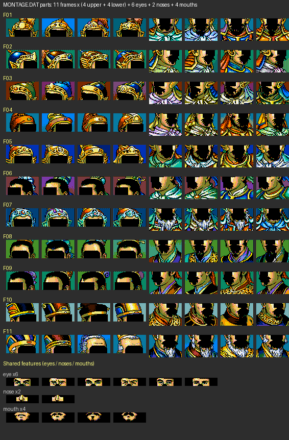
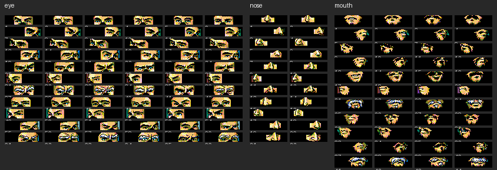

# 三国志3 MONTAGE.DAT 大众脸素材解析

## 概述 / Overview

**中文**：`MONTAGE.DAT`（139,392 字节）是 DOS 版《三国志3》（光荣 KOEI，1992）的**大众脸（杂鱼武将）头像拼装素材库**。游戏里约 311 名大众脸武将没有单独绘制头像，而是由本文件中的零件拼出 64×80 的脸：11 种框架造型，每款含上半部 4 种、下半部 4 种、眼 6 种、鼻 2 种、口 4 种，共 220 个零件。武将在剧本/存档中的头像值大于 307 时按大众脸机制拼装（小于 307 读取 `KAODATA.DAT` 的专用头像）。

**English**: `MONTAGE.DAT` (139,392 bytes) is the generic ("mob") officer face part library of the DOS *Romance of the Three Kingdoms III* (KOEI, 1992). Instead of individually drawn portraits, ~311 generic officers are assembled from this file into 64×80 faces: 11 frame styles × (4 upper halves + 4 lower halves + 6 eyes + 2 noses + 4 mouths) = 220 parts. Face values > 307 trigger the montage mechanism (≤ 307 read dedicated portraits from `KAODATA.DAT`).

---

## 文件结构 / File Layout

```
11 个框架组 × 12,672 字节 = 139,392 字节
每个框架组（= 一种框架造型，前 7 组武官 / 后 4 组文官）含 20 个部件：
  4 个上半部   64x36   864 B   (组内 offset 0, 864, 1728, 2592)
  4 个下半部   64x44  1056 B   (组内 offset 3456, 4512, 5568, 6624)
  6 个眼睛部件 64x16   384 B   (组内 offset 7680 + i*384)
  2 个鼻子部件 64x16   384 B   (组内 offset 9984 + i*384)
  4 个嘴巴部件 64x20   480 B   (组内 offset 10752 + i*480)
```

像素为 **3 bit/像素（8 色）**，采用光荣早期位平面存储：每 3 字节表示 8 个像素，像素 i 由三字节第 i 位的组合而成（与 `KAODATA.DAT` / `GRPDATA.DAT` 相同）。

## 调色板 / Palette

| 索引 | RGB | 索引 | RGB |
|---:|---|---:|---|
| 0 | 黑 #000000 | 4 | 蓝 #0041F3 |
| 1 | 绿 #10B251 | 5 | 青 #00C3F3 |
| 2 | 橙红 #F35100 | 6 | 品红 #F351D3 |
| 3 | 黄 #F3E300 | 7 | 白 #F3F3F3 |

---

## 渲染结果 / Rendered Output






- `montage_upper.png`：44 个上半部（帽子/盔甲等）
- `montage_lower.png`：44 个下半部（下巴/胡须/肩甲）
- `montage_features.png`：66 眼 + 22 鼻 + 44 口
- `montage_sample_faces.png`：11 个框架各拼一张示例大众脸（五官叠放位置为逆向推测，仅供辨认风格）

## 使用方法 / Usage

```bash
python decode_montage.py <MONTAGE.DAT 路径> <输出目录>
```

依赖：Python 3 + Pillow。

---

## 参考 / References

- 大众脸拼装机制与框架数量：PTT Koei 板 yuxio《三国志3 大众脸脸谱研究》（2013）。
- 位平面 3bpp 解码：与 [tzengyuxio/kaodata](https://github.com/tzengyuxio/kaodata) 项目 `dekoei/utils.py` 的 `to_3bpp_indexes` 一致。
