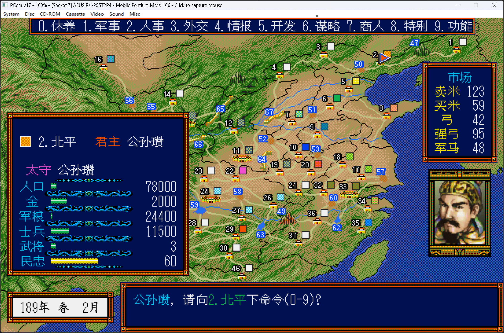
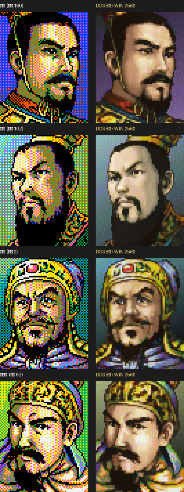

# 三国志3（DOS）高清头像浮层 —— 三国志3_头像

> 🌐 [English README](README.en.md)

在 DOSBox-X / PCem 里玩 DOS 版《三国志3》时，用一个透明置顶浮层把游戏里 64×80、8 色的头像，**原位替换**成 Windows 版 256 色的高清头像。





## 概述
- 支持 DOSBox-X 与 PCem 等模拟器（按窗口标题匹配，可逗号列多个目标）。
- 浮层只跟随“**当前在前台的匹配窗口**”；不在前台就整体隐藏，避免遮挡其它窗口。
- **同屏多个头像一起替换**（大图 + 小缩略图都识别），左上角锚定、保持 4:5。
- 对位/大小/比例/缩放/内容区偏移**按目标（模拟器）分别校调**（见 `config.ini`）。
- 跟随窗口移动、拉伸、DPI（桌面缩放%）缩放。

## 头像素材来源（逆向）
- **DOS 版** `KAODATA.DAT`：307 张 64×80、8 色；位平面 = 每 3 字节表示 8 像素；调色板取自官方 `dekoei/san3.py` 的固定 8 色。
- **Windows 版** `FACES.BMP`：768×4160、12 列；索引 **0–306 = 307 张专用脸**，**307–311 = 空槽**，**312–622 = 大众脸（311 张）**；解码时跳过 `[307,308,309,310,311,623]`。
- 两版**专用脸同序同人**（编号对齐）：DOS 编号 i ↔ `FACES.BMP` 编号 i，无需做像素跨版本匹配。
- 头像编号 ↔ 人名：来自 `SNDATA#B.CIM` 人物表的「顏」字段（<307 专用脸；>307 大众脸，v1 不替换）。

## 工具结构
```
san3overlay/
├─ san3overlay.py        主程序（透明置顶点击穿透浮层）
├─ config.ini            配置（多目标 / 阈值 / 缩放 / 按目标校调）
├─ requirements.txt      依赖
├─ README.md             本说明
├─ screenshot_PCem_公孙瓒.png  效果截图
└─ assets/
   ├─ refs/000..306.png  307 张 DOS 参考脸（用于模板匹配）
   ├─ win/000..306.png   307 张 Windows 高清脸（用于显示）
   └─ persons_s1.csv     剧本一人物表（编号↔人名）
```

## 运行流程（`san3overlay.py`）
`PrintWindow 抓模板器窗口自身内容（不含浮层，避免自抓反馈）` → 饱和度+最大连通域**自动定位游戏内容区** → 多尺度(1.0/0.75/0.5)多目标模板匹配（先粗筛 1/ds、再 top-k 全分辨率精配）→ 取高分专用脸 → 按左上角锚定把 `win/{idx}.png` 缩放到对应位置替换。

## 关键实现 / 踩坑
- **抓屏**：用 `PrintWindow`（只抓目标窗口），浮层不会被自己抓进去，无反馈回路、不闪。
- **坐标/DPI**：把 Win32 物理像素按 `dpr`（= 桌面缩放 %，如 150% 填 1.5）换算成 Qt 逻辑像素；不同模拟器内容几何不同，故 per-target 提供 `x,y,size_x,size_y,scale_x,scale_y,content_x,content_y` 手动校调。
- **上下 1px**：对游戏头像区间的**两端分别取整，高度 = 两端差**，缩放为小数时也不累积缝隙，与位置微调无关。
- **切换即清**：画面显著变化时立即清掉旧头像（`clear_shift` 可调），不再等慢速扫描。
- **全屏/独占**：独占全屏（DirectDraw/OpenGL）会压在浮层上，导致浮层不可见；建议用**窗口模式**或**最大化窗口（非独占）**。

## 使用
```
pip install -r requirements.txt
python san3overlay.py
```
1. 先用 DOSBox-X / PCem 运行三国志3（建议 `aspect=true` 保持比例 + 隐藏模拟器菜单栏）。
2. 让模拟器成为前台窗口，浮层会自动替换识别到的专用脸头像。
3. 退出：`Ctrl+Alt+Q`（全局），或终端 `Ctrl+C`。
4. 详细配置见 `config.ini`。

## 已知限制
- v1 只升级 0–306 专用脸；大众脸（>307）保持原样。
- 自动内容区检测在不同窗口尺寸/界面下精度有限；最大化/全屏需要按 `config.ini` 手动校调 `scale/content/offset`。
- 独占全屏下浮层无法显示，建议窗口模式。
